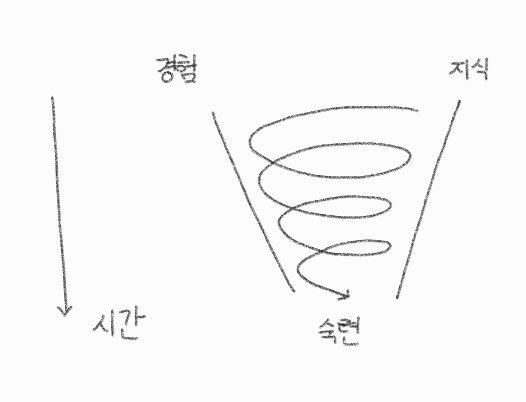

특정 기술에 숙련되려면 지식과 그 지식을 적용하는 경험 둘 다 필요하다.

- 지식만 쌓으면 변화하는 현실의 변수에 취약하다.
- 경험만 쌓으면 해결책이 한정될 수 있고 익숙한 것만 추구할 수 있다.

경험이나 지식을 적절하게 번갈아 쌓으며 숙련의 단계에 서서히 도달한다.

- '나만의 개발 공부법 찾기'[^1]의 공부법 소용돌이 모델이 잘 묘사한다.
  - 

- '균형 있는 역량 삼각형'[^2]과 비슷하지만 여기서는 숙련도도 경험과 지식과 함께 역량을 위한 3가지 요소로 표현한다.

---
다른 자료와의 연결

[^1]: [[유튜브] 5. 나만의 개발 공부법 찾기 _ 빠르게 성장하고 싶은 주니어 개발자를 위한 소프트 스킬 5가지, 토스 SLASH 24, 2024](https://youtu.be/JyAiWo4ghVg?feature=shared&t=1436)
[^2]: [[도서] 프롤로그 (p.13) _ 개발자로 살아남기, 박종천, 2023](https://product.kyobobook.co.kr/detail/S000001953766)
