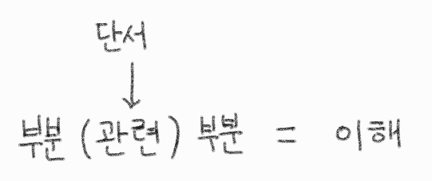
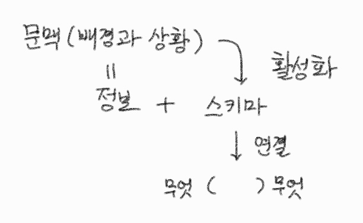

## **소개**

### 책에 대하여

‘안다는 착각’이 왜 더 나은 읽기의 장애물이 되는 이해를 돕고 벗어날 수 있는 방향도 제시한다.

적절한 예문들을 넣어 실제로 어떻게 작동하는지도 느낄 수 있어 좋았다. (초등학교 교과서 지문부터 인지심리학 논문 예시들까지)

### 이해의 흐름

1. 앎의 상태 단계들을 이해한다. (틀리게 아는 \= 모르는 → 아는 → 더 잘 아는)
2. 문맥과 스키마를 이해하고 상태들에 대해서 어떻게 작동하는지 이해한다.
3. 오독하게되는 안티패턴들과 안다는 착각 상태의 특징들을 이해한다.
4. 위 이해들을 토대로 탈출하는 방법을 이해한다.
5. 해석이 가능한 범위를 정합성과 연관지어 이해한다.

## **1\. 배경지식**

### 모르는 → 아는 → 더 잘 아는

글의 부분과 부분들을

1. 관련 짓지 못하면 ‘모르는’ 상태
2. 관련 짓는 다면 ‘아는’ 상태
3. 긴밀하게 관련 지어지면 ‘더 잘 아는’ 상태
   * 단서를 활용: (1) 글 밖 지식, (2) 직접 만든 가정

### 문맥

“문맥”: 일이나 정보 등이 놓인 배경과 상황 ≈ ‘무슨 이야기’ ⇒ 스키마를 활성화(priming)

* 배경은 time-dependency ↓, 상황은 time-dependency ↑

문맥에서 의미를 끌어냄 즉 적혀있지 않는 내용도 더 잘 이해함

* 끌어내는 내용도 문맥에 따라 달라짐.
  * <my>그래서 내가 세상을 바라보는 관점, 세계관이 중요하다고 하는구나.</my>

아는 상태: 문맥과 모순이 없음. 
모르는 상태: 의미를 끌어내지 못함.

문맥도 효과 있거나 효과 없는 것 둘 다 있음.

### 스키마

이해하기 위한 단서인 ‘스키마’는 이미 존재하는 무엇에 대한 지식 꾸러미다. 
스키마 활성화는 상황에 맞춰 지식 조각을 꺼내는 것이다.

* 이것이 빨라지면 priming이라고 한다.

## **2\. 문제**

### 문제의식

Q. 왜 더 알고 싶어하지 않을까?

A. 얕은 이해를 탈출하기 어려운 이유는 ‘모르는’ 상태여서. 
&nbsp;&nbsp;&nbsp;&nbsp;그런데 이것도 일종의 ‘아는’ 상태이다. \= 모르는 부분이 없는 안정 상태이자 정체 상태이다.

Q. 왜 문제일까?

A. 1\) 더 나아가려는 탐구 활동을 방해한다. 
&nbsp;&nbsp;&nbsp;&nbsp;2\) 내버려두면 나아지지 않는다.

### 오독

‘글의 분위기’(문맥과는 약간 다름)로 의미를 끼워 맞추는 함정에 빠질 수 있다. \= 오독

‘틀린 안다는 착각’은 성립하는 이유는 부분을

1. 충분히 읽지 않아서
2. 틀리게 읽어서

본질적으로 둘 다 안다는 착각에 있어서 동일하다. 
둘다 똑같은 구조로 유지되며 명확한 문맥으로 꿰맞추는 식으로 작동한다.

오독의 영향은 나중인 전체적인 이해 단계에서 발견되는 것이 아니라, 발생 시점부터 틀린 문맥을 제공하여 나비효과처럼 영향이 퍼져나간다.

### 더 잘 알기 위한 발판: 모순, 의문, 모르는 것

‘모순’이나 ‘의문’이 ‘더 잘 알기’ 위한 계기를 마련한다. 
그렇기에 이를 발견함은 오히려 긍정적으로 문제 해결의 실마리를 찾은 것이다. \= ‘인식의 진언’

* <my>모든 것을 의심/회의해서 사고의 토대를 쌓고 전진한 데카르트의 방법론적 회의가 생각났다.</my>

모르는 것이 나왔다는 것은 이전에 알고 있는 것을 사용하고 있다는 뜻이다.

건너뛰면서 읽으면 ‘문맥의 침입’(≈ 모순)을 발견할 확률이 낮아진다.

* 마치 ‘아아, 그 이야기겠네’ 하는 선입견을 가지고 훑는다.

그러나 건너뛰지 않고 읽으면 비교적 ‘신선’하게 느끼면서 읽게 된다.

### 안다는 착각의 특징

1. ‘결과로부터’: 결론으로 초중반 끼워맞추기
2. ‘처음부터’: 초반으로 중후반 끼워맞추기 \= 변화하는 재미 ↓
3. ‘여러가지’: 실제 요소들을 뭉뚱그림

당시에는 ‘아는’ 것 같다.

스키마 오류는 2가지가 있다.

1. 스테레오 타입: 스테레오에 간편이 꿰맞춘다.
2. 이야기: 의미를 부여하기 위해서 꿰맞춘다.

이렇게 꿰맞춰진 스키마는 ‘무던한’  2가지 패턴이 있다.

1. 선한 것: 선한 것은 대다수가 동의할거라 여겨 이에 끼워맞춘다.
2. 무난: 사회적 정당성에 끼워맞춘다.

## **3\. 해결책**

### 탈출 방법

‘궁금증’을 유발하는 것은 (1)지식의 어긋남, 또는 (2) 예상/생각과의 차이다.

여기까지가 출현 기제 이해의 밑바탕이 된다.

- [ ] 지금 보이지 않는 내막이 있을거라 인식한다.
    * (주의) 가능성을 주지 않으면 확증편향으로 치우칠 수 있다.
- [ ] 읽은 글을 의식적으로 자기 나름대로 정리한다.
    * (주의) 정리가 너무 간단하면 잘못 읽었을 가능성이 높다.
    * (주의) 스테레오와 동일하면 의심한다.
    * 정리된 글에 ‘무던한’ 허세가 없는지 살펴본다.
    * 정리와 예시가 잘 대응하는지 확인한다.
- [ ] 스키마에 반하는 부분을 읽으면서 찾는다.

물론 쓰는 이의 책임으로 모순이 해결 안되는 경우도 있다.

### 어디까지 올라가는 거에요.↗

‘읽기’라는 탐구 과정은 끝이 없다. 
항상 ‘더 잘 읽기’보다 ‘더욱 더 잘 아는’ 상태가 존재한다.

1. ‘안다는 착각’
2. 새 문맥 → 새 의미
3. 새 의미 → 모순, 무관련 \= ‘모르는 상태’
4. 새 모순 없는 관련 → ‘더 잘 아는 상태’ ⇒ 새로운 모르는 상태

## **4\. 정답 vs. 해석의 자유? 정합성\!**

### 정합성

저자가 주장하는 것은 해석이 ‘맞다, 틀리다’를 강조하기보다 ‘정합성’(consistency)를 추구하자는 것이다.

* 옳고 그름을 강조하면 다른 해석을 배제하게 된다.

구축 → 부수기 → 구축 → …

1. 여러 해석이 가능하고 유지된다.
2. 해석 하나가 정합하다고 유일한 답이라고 하지 않는다.
3. 해석의 부정합이 발견되면 폐기한다.

<my>마치 헤겔의 정반합과 같다. 정 + 반 → 합 \= 정 + 반 → 합 …</my>

### 질문하는 방법

Q. 지문 해석 문제에 있어 답은 하나(1)일까 해석의 자유(∞)가 있을까?

A. 둘다 아니고 정합성의 틀 안에서(N) 해석의 자유가 있다고 한다.

질문을 ‘적절하거나 적절하지 않은 것’보다는 ‘가능한 또는 가능하지 않은’ 것을 고르시오가 좋다.

* 적절은 맞고 틀림을 말하고, 가능은 정합성을 말한다.

## **다른 생각과의 연결**

* 다시 접하고 ‘모르는 부분’을 새로 발견한다.
  * 데미안을 세월이 지나면서 다르게 느껴지는 것. \_ ???
* 다른 사람이 내가 생각한 ‘더 잘 읽었다’보다 더 깊은 해석을 제시할 수 있다.
  * 장기하의 밤양갱 작사에 숨겨진 디테일을 발견한 이적 \_ [밤양갱 듣고 장기하에게 연락한 이적](https://www.youtube.com/watch?v=PXmsg5zHdFE)
* 똑같은 것을 다른 측면으로 보는 것이 중요하다.
  * 그래서 개인이 아닌 팀으로, 그리고 팀이 모여 논의하는 것의 장점이 있다.

