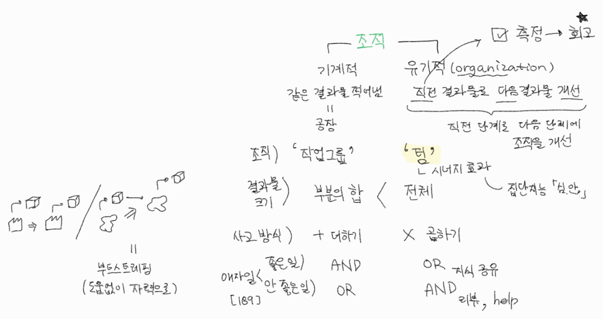

# 소개

2년 전에 읽었는데 최근 성장을 고민하면서 다시 찾게 되었고, 이번엔 내용을 정리하면서 읽음.

- 확실히 다시 그리고 자세히 읽으니 내용이 새롭게 느껴지고 기억에 더 잘 남음.
- 어렴풋이 남았던 기억들은 'A,B,C 작업', '난이도-실력 그래프', '쉽지만 효율 낮은 도구부터 개선', 그리고 '복리'였다.

전전에 『실용주의 사고와 학습』[^1]을 읽고 바로 이어서 『린 소프트웨어 개발』[^2]을 읽으니 겹치는 내용들이 더 인식되었다.

- 두 권 모두 저자가 감수한 책들이고 특히 『실용주의 사고와 학습』[^1]은 그 책의 저자와 의견들이 오갔으며 집필에 도움을 주었다고 한다.
- 그리고 『1만 시간의 재발견』[^3] 저자인 안데르스 에릭슨의 전문성 연구를 여러번 인용한다.

# 중요한 키워드

불확실성, 학습/성장, 협력, 의도적 수련, 전문가, 경험, 복리, 암묵지, 사회적 자본

# 자라기

🧭 매일매일 함께(협력) 자라기(학습)

불확실성↑ ⇒ 학습의 중요성↑

☑ 학습을 학습

- to tackle 불확실성
- 무지성 학습 X

## 몇년차 #1

의도적 수련[^3]으로 성장

- not just 즐기기 _ 잘하다 vs. 즐기다[^4]
- 피드백 주기 ↓ - 애자일 철학
    - = 개발 병목

경력(경험)의 함정

- 2년차부턴 경력 상관성 ↓

☑ 시간 투자
- (1) 생각 기록 → 나중에 확인
- ex. 진단 전문의

☑ 전문가는 실행 < 문제 이해

경험만이 아닌 실력이 뛰어난 전문가

- 실력 = 지식 + 경험
    - 경험은 질적인 면이 중요
- 실력 ↓ ⇒ 직관[^1](문제 이해) ↓

## 자기계발은 복리 #2

복리 효과로 자라기

1. 이율 자체 ↑
2. 지속적 투자 _ 습관[^5]

☑ 1년마다 지인들과 회고[^10]
☑ 자기 계발: 지금 투자 ⇒ 1,2년 뒤 효과

- 1시간 = 기본 (직장인 평균)
- '작년보다 나은 나' [p209]
    - 하루, 한 주, 한 달, 한 분기, 한 반기, 1년, 3년, 5년, 10년

---

### A, B, C 작업 #2-1

- 맨 아래 make it work, right, fast는 책 내용은 아니고 코딩 피라미드가 연상되서 기입
- ABC 모델은 더글라스 앵글바트가 말했다.
    - 그 분의 철학인 컴퓨터로 이롭게는 감명 깊었다. _ 'Augmenting Human Intellect'

### 작업그룹 vs 팀 #2-2

- 기계적 조직 vs 유기적 조직
- 더하기 사고 vs 곱하기 사고
- 부분의 합 < 전체

- 직전 결과물로 다음 결과물 개선
    - 부트스트레핑

Q. 어떻게

1. 더하기 아닌 곱하기?
2. 곱하기 비율 ↑? (≈ 이율 자체 ↑)

힌트\) ☑

1. 이미 있는 지식 활용
    - 서로 연결 _ 제텔카스텐[^6] _ 과 충돌 _ 차이/비교[^3]
2. 외부 재료 자기화
    - if not 내부에서 수렴 _ 좋은 모델[^3]
3. B,C를 개선하는 프로세스 만들기
    - 회고?
4. 일찍, 자주, 작게라도 피드백 받기 ⇒ 실패에서 학습하기
5. 능력 UP하는 도구와 환경을 점진적으로. = 중력을 줄여나감. (메타포) _ 에너지 관리[^7]
    - but 완벽한 도구와 환경은 없다.

## 학습 프레임과 실행 프레임 #3

## 직업 학습 난이도 ↑ ⇒ 생존 ↑ #4

타인과 소통하는 능력 = 컴퓨터화로 대체 어려움. 인간의 강점.
⇒ ☑ 지금부터 창의적, 사회적으로 암묵지와 직관 배우기.

## 달인이 되는 비결 #5

단순 반복은 실력 오르지 않음.

1. 개선 동기 ~ F
2. 구체적 피드백을 적절 주기로 ~T

## 수십년 but 달인 X? #7

전문가는 믿을 수 있는 **직관**이 있다.

- 반-직관 학파(HB)와 직관 학파(NDM)의 공통
- 믿을 수 있는: (1) 타당성 (2) 피드백
    - ☑ 이 환경을 지향. 또는
    - ☑ 내가 일하는 방식을 바꿔
        1. 변수 제한 → 규칙성 발견
        2. 직접 피드백 구함

## 나는 왜 성장 X (제자리) ? #8

의도적 수련이 중요.
필요 요건은 실력 ≈(비슷) 난이도.

- 적절한 i+1

- ☑ 내 상태를 의식하기

몰입 밖(불안함 OR 지루함)에서 안으로 들어가는 방법 4가지 = 제자리 걸음 탈출

### 지루함(너무 쉬울 때)에서 시작 #8-1

a1\) 실력 낮추기 ≈ 모래주머니 (ex. 도구 안/덜 쓰고)

a2\) 난이도 높이기: 요구 수준 스스로 높이기

- 남들보다 효과적/효율적으로
    - ex. 나만의 도구/환경 구축 _ 점진적으로 구축 #2-2
- DRY를 파악하고 개선

### 불안함(너무 어려울 때)에서 시작 #8-2

b2\) 실력 높이기

1. 사회적 - 나보다 뛰어난 전문가 도움
2. 도구적 - 다른 도구의 도움
3. 내관전 - 비슷한 경험 활용 ⇒ 자기효용감 ↑

b1\) 난이도 낮추기: 아기 버전[^2] 먼저 → 정식 버전

- 2번의 학습 효과 = 복리 이익
- 쉬운 것 먼저 → 어려운 것 먼저 ⇒ 결함 수 ↓

## 의도적 수련 일상의 예시 #8

☑ 난이도 조절을 적극적, 점진적으로

- ex. 시간 제약, 목표 높이기

## 프로그래밍 언어 배우기의 달인 #9

☑ 전문가를 역엔지니어링('인지적 작업 분석')해서 배우는 것이 단기간에 빠르게 전문성을 높인다.

- 메뉴얼처럼 묻는게 아니라, 구체적 사건으로 유도 (암묵지, 직관, 의사결정)

Q. 새 프로그래밍 언어를 빠르게?

1. 만들 것을 염두하고 튜토리얼 읽기 = '적극적 읽기' _ 가추법, POR
    - 같은 알고리즘, 다른 언어: 차이를 알기 좋음
2. 좋은 코드 (ex. 숙어) 많이 읽기.
    - 코딩은 읽기 >> 쓰기

3. 실질적인 사용 예 만들기

## 실수는 예방 X 관리 O #10

실수는 관리 not 예방

- <실수>는
    - 관리: 좋은 학습 기회
    - 예방: 망신

그래서 오히려 실수 훈련

- 전문가에게 실수 대처법 배우기 _ [낙법]

실수 없이는 학습 X

Q. 관리?

1. 조기 발견
2. 빠른 조치

## 뛰어난 선생 미신 #11

교사는 뛰어난 지식보다 온전하게 가르치는 것이 중요

70%는 가르치지 않음 ⇒ ☑ 교사와 학생 둘 다 인지적 작업 분석하기

- 전문가는 이미 자동화, 암묵지

## 나 홀로 전문가 미신 #12

전문가에 사회적 자본은 필수다.

- 좋은 기술도 사회적 맥락에서 전파된다.

☑ 마이크로인터랙션에 신경 쓴다.

- 기록 → 복기 → 수정 (다르게 인터랙션)
    - '이랬으면 어떨까?'

# 함께

제대로 된 협력 배우기 not 초반에 업무 선 긋기

## S/W 관리 개선 순위 #13

but (가장 쉬운 것부터) 반대 순서로 개선하려함. 조엘 테스트.

☑ 맥락을 이해하고 개선해야 한다. _ 맥락을 고려하라[^1]

S/W dev 관리 3가지 증력

1. 관찰
2. 복잡한 상황 이해
3. 행동

## 협력으로 추상화 UP #14

짝 프로그래밍은

1. 대화로 추상화 UP
2. 구체화로 검증

다른 시작을 가진 둘이서 같이 대화하며 일하면 추상화 UP → '창발적 추상화'

소프트 스킬 - 커뮤니케이션과 협력에 더 많은 시간

## 공유 신뢰 UP vs. DOWN? #15

복수공유 만이 효과적이다. not 하나 공유, 최고 공유.

- 여러개 = 내 자신과 일치 DOWN ⇒ 불안간 DOWN
    - _ opposite to. 결론을 내리는 연습?[^8]
        - 결론은 한 가지가 아니라 여러 결론? = 복수 선택지
    - _ Plan B를 준비하는 것을 가르치기 _ 미국 육아

소통 신뢰

- 투명성
- 공유 - (주의) 신뢰를 떨어뜨리는 공유
- 인터랙션

## 객관성의 주관성 #16

> 품질이란 누군가에게 가치가 되는 것이다. _ 제덜드 와인버그

- 『린 소프트웨어 개발』[^2]
    - opposite to. 낭비 [p37]
    - also 서비스 vs. 개발의 품질 [p56]

객관성, 논리적 = 환상.

- 사람에 따라 다르다(상대적, 주관적이다). ex. 성격
- 감정과 이성은 분리 안됨.
    - 결정은 결국 사람이 한다.

설득은 자료가 아니라 설득의 대상의 이해에서 시작.

- 대상의 이해에 더 많은 시간 투자.

## 이것도 모르세요? #17

상대의 멘탈 모델을 이해하는 코칭 _ 인지적작업분석 #11

1. 어떻게 이해하는지 - 지식
2. 어떻게 해결하려는지 - 가설
3. 어떻게 답을 확인하려는지 - 검증

- 인지적 작업, 멘탈 모델

해당 영역 지식 없어도 OK!

## 하향식 접근의 함정 #18

전문가일 수록 자기 수정 횟수 UP

삼투압적 의사소통 - '협력' _ 이동 (1원칙 7가지 중)[^2]

- 바통터치 비용 DOWN

## 전문가 팀이 실패하는 이유 #19

전문가

- 더 어려운 기술
- 더 빨리

## 탁월한 팀? 🔍 by 구글 #20

심리적 안정감 → 실수 관리 _ 에이미 에드먼슨, What Google Learned From Its Quest to Build the Perfect Team

☑ 실수에 대한 마이크로 인터랙션

##  쾌속 학습 팀 #21

(목표) 빠른 학습: 학습과 실행은 동시에 _ 성장, 실행 프레임 #3

- ☑ 작고 유용한 프로그램 만들기 _ 실질적인 사용 예 #9
    - TIP) 구체적으로 안 떠오르면 반대로 생각: '크고 불필요한' 프로그램
- ☑ 학습 공동체

학습이 빠른 팀

1. 협력적 선발 & 기준
2. 새 기술 도입
    - != 기술적 도전
    - = 조직적 도전

3. 심리적 보호, 모두가 공유 _ 투명성 - 소통 신뢰 #15

학습 속도 - (비례 X) - 경험, 지식

Q. 조직, 팀에서 내가 먼저 할 수 있는 일?

☑ 학습 환경 구축

## 프로젝트 확률론 #22

애자일은 좋은 일 ++, 나쁜일 --

- 일의 단계 X ⇒
    - 일 진행 → 추정치 ↑ _ burndown chart[^2]
    - 낙관적 추정 편항 ↓
        - 전통 순차 모델

애자일 - 관심사의 섞임 (opp. 관심사의 분리 SoC) ⇒ 개개인이 동일한 시행 착오 X

- 내 일이 끝나면 다른 사람 도움

- 지식 공유

사람들은 일을 낙관적으로 추정: 보통 추정치 2-3배 해야 80% 달성. best와 중간 추정치 차이 거의 X.

- 불일치 UP ⇒ 불확실성 UP

    - 경험의 단절

- AND 조건과 OR 조건의 인지적 편향

# 애자일

애자일은 학습과 협력으로 불확실성을 다룬다.

- 학습 = 자라기
- 협력 = 함께
- 불확실성: 처음부터 철저한 계획은 불가능

피드백 - 일찍, 짧은 주기, 자주 여럿

학습: 방향 재조정

협력:

- 안 좋은 일 → 공유와 검토로 (AND 조건)
- 좋은 일 → 확장 (OR 조건)

## 애자일의 씨앗 #23

고객에게 / 매일 / 가치를 / 전하라

- 가치를 전하라 then 협력 UP
- 매일: (불확실성 높을 수록) 빈도 + 이른 시점. _ 학습

성장의 씨앗! _ ≈ 'elevator talk'[^11]

## 애자일 도입 성공 요인 분석 #24

애자일 성숙도 → (실천법 개수 →) 성공도

- 고객 참여 = 함께
- 짧은 개발 주기 = 자라기

    - 짧은 주기가 부족한 참여 보완

누구나 애자일 코치가 될 수 있다.[^9]

- 전문가는 주어진 일 외에도 관심을 가짐

초보자는 쉬운 것만 먼저. 어려운 것은 미룸.

☑ 전문가는 어렵고 두려워도 중요하면 한다.

- 리스크를 인식하고 꾸준히 시도

## 우리 회사는 왜 새 방법이 안 먹혀? #25

결국 사람(WHO)이 중요하다.

치료자 효과, 슈퍼 슈링크. ☑ 찾고, 연구하고, 육성

- 단순한 도메인: 결과가 예측 가능 ⇒ 메뉴얼이 먹히는
- 복잡한 도메인에서 치료자 효과가 큼
    - 사람 요소가 차지하는 비율 HIGH
    - 보편적 규칙들 LESS

## 애자일을 애자일스럽게 도입 #26

애자일은 어떤 방법론 도입에든 적용

- 방법론 도입 자체가 불확실성 HIGH
- 방법론보다 이면의 문화와 구조가 핵심
    - 도요타 방식은 도요타만 가능했다.

# 끝에 느낀 점

 💡 일이든 인생이든 내 인격 자체를 수양, 개선한다.

- ex. 대화법, 사고법

[^1]: [[도서] 실용주의 사고와 학습, 앤디 헌트, 1999](https://product.kyobobook.co.kr/detail/S000001766246)
[^2]: [[도서] 린 소프트웨어 개발, 메리 포펜딕, 2007](https://product.kyobobook.co.kr/detail/S000001469789)
[^3]: [[도서] 1만 시간의 재발견, 안데르스 에릭슨, 2016](https://product.kyobobook.co.kr/detail/S000001892497)
[^4]: 잘하다 vs. 즐기다
[^5]: 습관
[^5]: [[도서] 제텔카스텐, 숀케 아렌스, 2023](https://product.kyobobook.co.kr/detail/S000208468354)
[^7]: [[도서] 일의 감각, 로저 니본, 2021](https://product.kyobobook.co.kr/detail/S000001729572)
[^8]: [[도서] 완벽한 선택은 없다, 안도 고다이, 2025](https://product.kyobobook.co.kr/detail/S000216497148)
[^9]: [[도서] 피플웨어, 톰 데마르코, 1999]() <!-- 교보링크 필요 -->
[^10]: [[유튜브] 퇴사는 이럴 때 하세요! (W/회사 10번 옮겨본 구글 수석디자이너), 2024](https://www.youtube.com/watch?v=uqxNdpNwzsU)
[^11]: [[위키피디아] Elevator pitch](https://en.wikipedia.org/wiki/Elevator_pitch)
